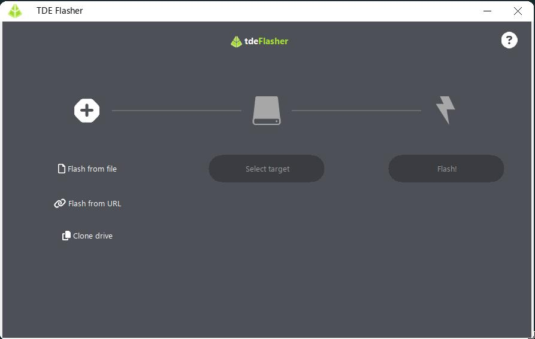
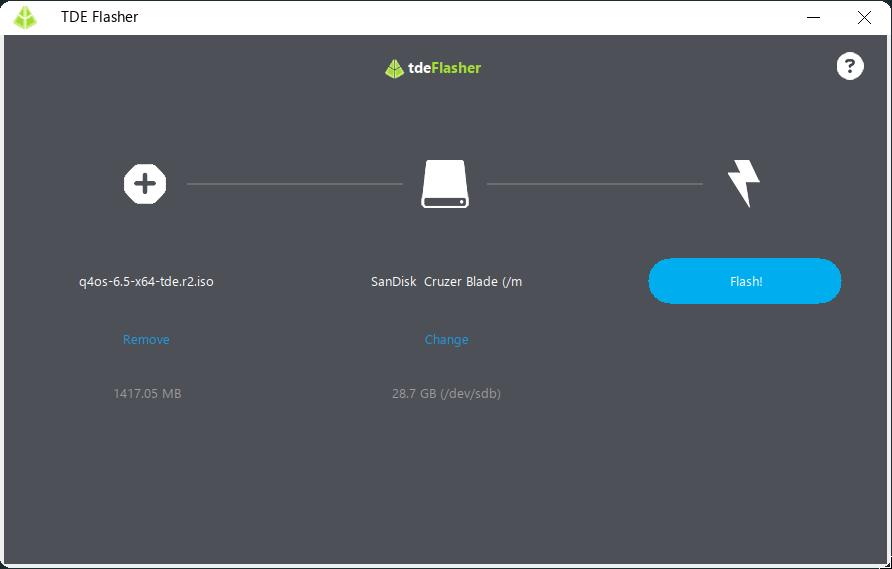
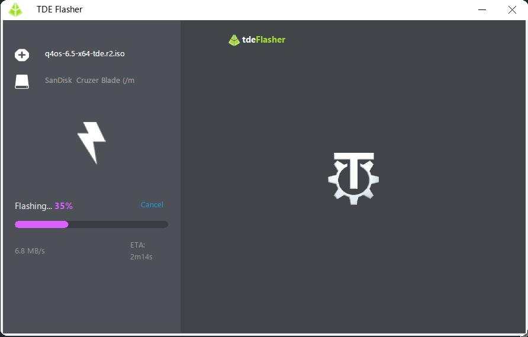
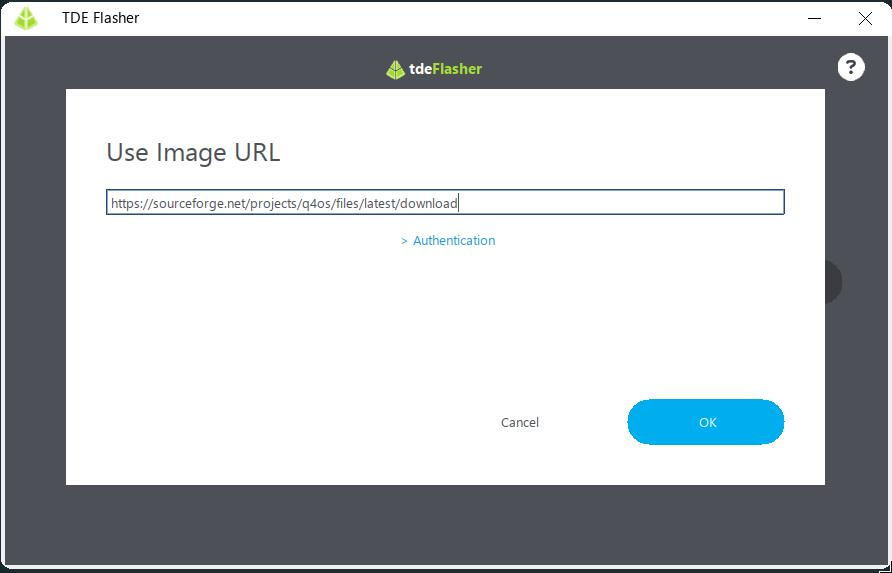

# TDE-Flasher


**TDE-Flasher** is a lightweight, blazing-fast, OS image flasher natively designed for the **Trinity Desktop Environment (TDE)** using the **TQt3** toolkit. 

This project is an assumed ^_^, native C++ clone of the popular [balenaEtcher](https://etcher.balena.io/) application, created to provide the exact same intuitive 3-step User Experience (UX) without the heavy resource overhead of Electron for Trinity desktop users.

## Features

- **Iconic 3-Step Wizard:** Select Image ➔ Select Target ➔ Flash!
- **Universal Image Support:** Flash raw `.img` / `.iso` files or compressed archives (`.zip`, `.xz`, `.gz`, `.bz2` etc.) seamlessly thanks to on-the-fly streaming extraction.
- **Flash from URL:** Directly write OS images from remote HTTP/HTTPS servers to your USB drive without downloading the file to your hard drive first.
- **Clone Drive:** Direct block-device to block-device cloning.
- **Safe & Verified:**
  - Automatic SHA-256 verification pass to guarantee data integrity.
  - Automatic detection of Windows installer images (which require special tools like WoeUSB/Rufus).
  - Warnings for system drives to prevent accidental data loss.
  - Verifies target disk size is larger than the uncompressed image payload.
- **O_DIRECT Writes:** Bypasses kernel page caching during flashing to prevent system RAM exhaustion and provide deterministic progress metrics.
- **Error Handling:** Robust error overlays and target retry mechanisms if a block device fails.

## Dependencies

To build TDE-Flasher from source, you will need a C++14 capable compiler and the following development packages:

- `cmake` (>= 3.10)
- `tqt3-dev` (Trinity Qt3 toolkit)
- `libarchive-dev` (Handles decompression)
- `libcurl4-openssl-dev` or `libcurl-dev` (Handles URL streaming)
- `libgcrypt-dev` (Handles rapid SHA-256 verification)

## Building from Source

1. Clone this repository (or extract the source).
2. Create a build directory and run CMake:

```bash
mkdir build
cd build
cmake ..
```

3. Compile the application:

```bash
make -j$(nproc)
```

## Usage

Writing to raw block devices (e.g., `/dev/sdX`) usually requires root privileges. Run the compiled binary using `sudo`:

```bash
sudo ./tde-flasher
```

## Why TDE-Flasher?

BalenaEtcher is a fantastic tool, but its reliance on web technologies (Electron/Chromium) means it often consumes hundreds of megabytes of RAM just to sit idle, which can be problematic on older hardware, often targeted by trinity desktop. 

TDE-Flasher perfectly replicates the beloved, foolproof Etcher workflow in a native, compiled TQt3 application that uses minimal memory and CPU cycles while running natively alongside the rest of your TDE applications.

## Screenshots





